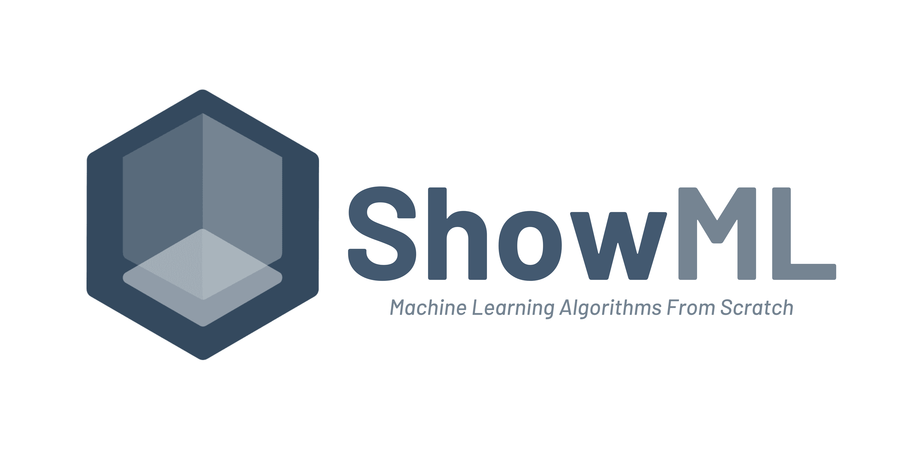

<!-- # ShowML

[](https://github.com/hasnainroopawalla/ShowML/actions/workflows/python_packaging.yml)

**Show** the **ML** Code!

A Python package of Machine Learning Algorithms implemented from scratch.

The aim of this package is to present the working behind fundamental Machine Learning algorithms in a transparent and modular way.

> **_NOTE:_**  The implementations of these algorithms are not thoroughly optimized for high computational efficiency.


## Usage
Check out: [showml/examples/](https://github.com/hasnainroopawalla/ShowML/tree/master/showml/examples).


## Installation


Install the package:
```
$ pip install showml
```

To clone the repository and view the source files:
```
$ git clone https://github.com/hasnainroopawalla/ShowML.git
$ cd ShowML
$ pip install -r requirements.txt
```

[How to Contribute](#contributing)


## Contents

### Models
#### Linear
- Linear Regression (`showml.linear_model.regression.LinearRegression`)
- Logistic Regression (`showml.linear_model.regression.LogisticRegression`)

#### Non-Linear
- Sequential (`showml.deep_learning.model.Sequential`)

### Deep Learning
#### Layers
- Dense (`showml.deep_learning.layers.Dense`)

#### Activations
- Sigmoid (`showml.deep_learning.activations.Sigmoid`)
- ReLu (`showml.deep_learning.activations.Relu`)
- Softmax (`showml.deep_learning.activations.Softmax`)

### Optimizers
- Stochastic/Batch/Mini-Batch Gradient Descent (`showml.optimizers.SGD`)
- Adaptive Gradient (`showml.optimizers.AdaGrad`)
- Root Mean Squared Propagation (`showml.optimizers.RMSProp`)

### Loss Functions
- Mean Squared Error (`showml.losses.MeanSquaredError`)
- Binary Cross Entropy (`showml.losses.BinaryCrossEntropy`)
- Categorical Cross Entropy (`showml.losses.CrossEntropy`)

### Simulations
- [Conway's Game of Life](https://en.wikipedia.org/wiki/Conway%27s_Game_of_Life) (`showml.simulations.conways_game_of_life.GameOfLife`)

## Contributing
1. [Fork](https://docs.github.com/en/get-started/quickstart/fork-a-repo) the repository.
2. Install the necessary dependencies:
```
$ pip install pre-commit mypy pytest
 ```
3. Commit and push your changes to your own branch.
4. Before submitting a Pull Request, run these housekeeping checks locally:-
  - Run [pre-commit](https://pre-commit.com/):
   ```
   $ pre-commit run -a
   ```
  - Run [mypy](https://github.com/python/mypy):
  ```
  $ mypy .
  ```
  - Run [pytest](https://docs.pytest.org):
  ```
  $ pytest
  ```
5. Once everything succeeds, create a Pull Request (CI will be triggered) -->


<p align="center">
  <a href="" rel="noopener">
    </a>
</p>

---


<h1 align="center">Show the <b><i>M</i></b>achine <b><i>L</i></b>earning Code</h1>

<div align="center">

[](https://github.com/hasnainroopawalla/ShowML/actions/workflows/python_packaging.yml)

</div>
